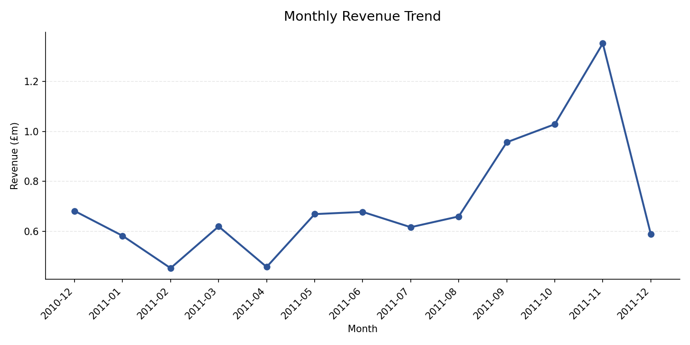
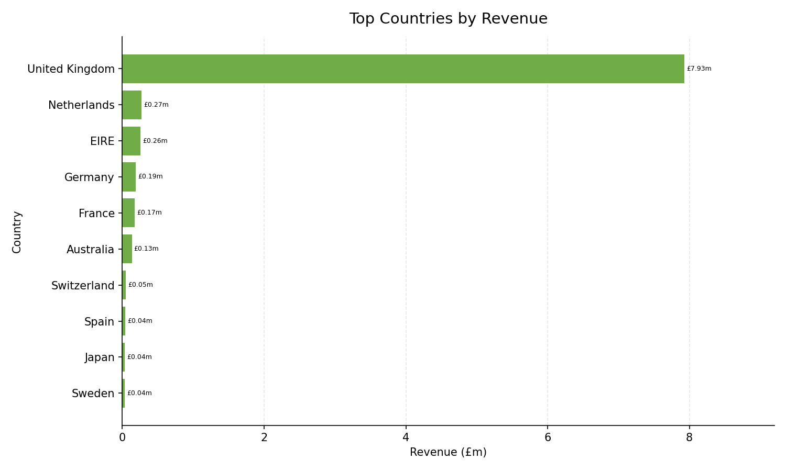

# Final Project Summary

## Dataset Overview

This project uses the Online Retail dataset, which contains transaction-level sales data for a UK-based online retailer.

The dataset includes invoice numbers, product codes, product descriptions, quantities, invoice dates, unit prices, customer IDs, and countries. The project uses this data to build a Python and SQLite KPI reporting pipeline for sales and operations analysis.

## Business Problem

Raw transaction data is not immediately suitable for business reporting. The source dataset includes cancellations, duplicate records, missing customer IDs, non-standard product codes, invalid transaction values, and dates stored as text.

The aim of this project is to clean and structure the data so that core business KPIs can be calculated more reliably and reviewed in a clear reporting format.

## Cleaning Approach

The data was cleaned in Python using pandas.

The cleaning process included:

- Standardising key text fields including invoice number, stock code, description, and country.
- Converting `InvoiceDate` into a usable datetime field.
- Converting `CustomerID` into a numeric field while allowing missing values.
- Removing exact duplicate rows.
- Creating a `Revenue` field using `Quantity * UnitPrice`.
- Flagging cancellations, negative quantities, zero or negative prices, missing customer IDs, missing descriptions, and non-standard stock codes.
- Adding reporting date fields including invoice date, year, month, and year-month.
- Creating separate outputs for master flagged data, sales-only reporting, and customer-eligible analysis.

The main reporting table used for sales KPIs is `sales_only_retail`, which excludes cancellations, non-positive quantities or prices, and non-standard stock codes.

## SQL KPI Results

The cleaned datasets were loaded into SQLite and queried using SQL.

Key KPI outputs:

- Total Revenue: £9,345,497.67
- Total Orders: 19,549
- Average Order Value: £478.06
- Cancellation Count: 9,251
- Cancellation Rate: 1.72%
- Top Country by Revenue: United Kingdom, around £7.93m
- Highest Revenue Month: November 2011, around £1.35m

## Chart Outputs

### Monthly Revenue Trend

This chart shows total revenue by month using the cleaned sales-only dataset. It helps show how revenue changes over time and makes it easier to identify peak trading periods.

From a KPI perspective, monthly revenue trend matters because it shows whether revenue is stable, growing, declining, or affected by seasonal trading patterns. In this dataset, November 2011 is the strongest revenue month, which suggests a notable late-year sales peak.

### Top Countries by Revenue

This chart shows the highest-revenue countries in the cleaned sales-only dataset. It makes the country-level revenue mix easier to understand at a glance.

From a business perspective, this matters because revenue is highly concentrated in the United Kingdom. That concentration is useful for understanding the core market, but it also means non-UK performance should be reviewed separately when assessing growth opportunities or market diversification.

## Business Findings

1. The cleaned sales-only dataset generated total revenue of £9.35m across 19,549 orders, giving a clear baseline for commercial performance.

2. Average order value was £478.06, which provides a useful benchmark for order-level sales performance and future KPI tracking.

3. The United Kingdom was the strongest revenue market by a clear margin, generating around £7.93m.

4. Revenue is highly concentrated in the UK, so UK and non-UK performance should be reviewed separately to avoid smaller markets being hidden by the main revenue base.

5. November 2011 was the highest revenue month, with revenue of around £1.35m.

6. The monthly revenue trend suggests a strong late-year trading period, which may reflect seasonal demand and would be important for stock, staffing, and campaign planning.

7. The dataset contains 9,251 cancelled rows, making cancellation tracking important for operational reporting and data-quality review.

8. Missing customer IDs limit full customer-level analysis, so customer KPIs should only be reported using records where a customer identifier is available.

## Limitations

- Customer-level reporting is limited because many records have missing `CustomerID` values.
- Cancellation rate is calculated at row level from the master flagged dataset, not as a percentage of distinct orders.
- The analysis is descriptive and focuses on KPI reporting rather than forecasting or machine learning.
- The project does not include external business context such as marketing campaigns, stock availability, pricing changes, or targets.
- Generated CSV outputs and the SQLite database are stored locally and are not committed to the repository.

## Future Improvements

- Export SQL KPI outputs into dedicated reporting tables or CSV files.
- Add automated validation checks for key row counts and KPI totals.
- Build a simple dashboard using the validated SQL outputs.
- Add customer-level KPIs using the customer-eligible dataset.
- Compare UK and non-UK performance in more detail to identify differences in revenue concentration and market behaviour.
